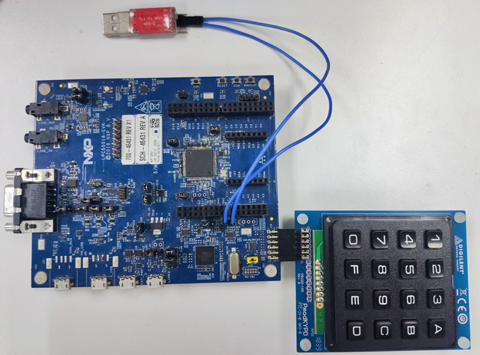

# NXP Application Code Hub

## EZH implements keyscan function in lpc5516
This demo introduces a method to implement 4x4 key value scan by using EZH in LPC55.

EZH, as a co-processor of LPC55, can quickly access IO. For mechanical repetitive tasks like keyscan, EZH provides high and low levels for each row of the keyboard, then quickly reads the level of each column, and finally determines which button is pressed. It is very suitable for keyboard applications.

#### Boards: LPCXpresso55S16
#### Categories: Industrial, HMI
#### Peripherals: GPIO, UART
#### Toolchains: MCUXpresso IDE

## Table of Contents
1. [Software](#step1)
2. [Hardware](#step2)
3. [Setup](#step3)
4. [Results](#step4)
5. [Support](#step5)
7. [Release Notes](#step6)

## 1. Software
- [MCUXpresso IDE V11.9.0 or later](https://www.nxp.com/design/design-center/software/development-software/mcuxpresso-software-and-tools-/mcuxpresso-integrated-development-environment-ide:MCUXpresso-IDE).
- SDK_2_15_000_LPCXpresso55S16
- MCUXpresso for Visual Studio Code: This example supports MCUXpresso for Visual Studio Code, for more information about how to use Visual Studio Code please refer [here](https://www.nxp.com/design/training/getting-started-with-mcuxpresso-for-visual-studio-code:TIP-GETTING-STARTED-WITH-MCUXPRESSO-FOR-VS-CODE).

## 2. Hardware
- Type-C USB cable
- LPCXpresso55S16
- Personal Computer
- Digilent PmodKYPD
- USB to TLL board

## 3. Setup
### 3.1 Step 1

Connect the PmodKYPD to the PMOD header on LPCXpresso55S16, as shown below:

### 3.2 Step 2

- Import the project to MCUXpresso IDE.

1. Open MCUXpresso IDE, in the Quick Start Panel, choose **Import from Application Code Hub**.

   ​	

2. Enter the demo name in the search bar.

    

3. Click **Copy GitHub link**, MCUXpresso IDE will automatically retrieve project attributes, then click **Next>**.

   ​	

4. Select **main** branch and then click **Next>**, Select the MCUXpresso project, click **Finish** button to complete import.

   ​	

- Connect the micro USB cable between the PC host and the USB port (J1) on the board.
- Short JP9 with jumper.   
- connect RX pin and ground pin of USB to TLL board with JP3 on LPCXpresso55S16.
- Open a serial terminal on PC for the serial device with these settings:
  - 115200 baud rate
  - 8 data bits
  - No parity
  - One stop bit
  - No flow control
- Compile and download to the board.
- Reset and run.

## 4. Results
Push down the keys on PmodKYPD board, the value will be shown on the serial terminal as below:

Button 3  is pressed 
Button 9  is pressed 
Button E  is pressed 
Button D  is pressed 
Button B  is pressed 
Button A  is pressed

## 5. Support
#### Project Metadata
<!----- Boards ----->

<!----- Categories ----->
 

<!----- Peripherals ----->
 

<!----- Toolchains ----->
 

Questions regarding the content/correctness of this example can be entered as Issues within this GitHub repository.

>**Warning**: For more general technical questions regarding NXP Microcontrollers and the difference in expected funcionality, enter your questions on the [NXP Community Forum](https://community.nxp.com/)

## 6. Release Notes
| Version | Description / Update                           | Date                        |
|:-------:|------------------------------------------------|----------------------------:|
| 1.0     | Initial release on Application Code Hub        | July 16th 2024 |

